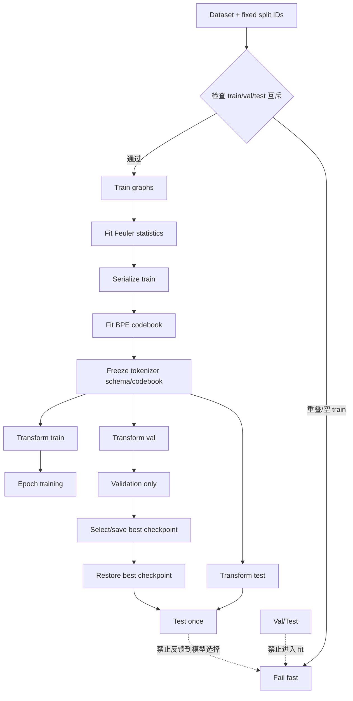

# GammaGL PR #260 GraphTokenizer 深度审查与 Codex 修复计划

**Executive Summary：** 当前 PR #260（提交 `bb0e7a6a85debc8ee87466c345a041e9ce9e6fcd`）可以看作一个“能跑的 GammaGL-native GraphTokenizer 原型”，但不能看作论文/正式 `release` 实现的等价移植。PR 页面显示其仍处于 Open 状态、包含 1 个 commit，并声称在 `TL_BACKEND=torch` 下相关测试为 146 passed / 2 skipped；正式 GraphTokenizer `release` 分支则把“训练图上的全局子结构频率 → 可逆 Feuler 序列化 → BPE → 标准 BERT/GTE”定义为论文复现路径。citeturn29view0turn21view1 **我的总体置信度：高。** 当前 PR 中除 `deserialize()` 外，至少还存在三个 P0 级问题：多维 node/edge feature 被压成首元素导致信息不可逆丢失；空训练 split 时把 `val+test` 用于 tokenizer/serializer/BPE 拟合；训练循环每个 epoch 访问 test。除此之外，GraphBPE、serializer 基础设施、数据 token mapping、BERT/GTE backbone 都与官方已有模块形成明显重复实现。fileciteturn0file0 需要特别修正上一版审查中的一个判断：进一步核验正式 `release` 后可以确认，**官方当前网页可见的预处理代码本身也存在“文档说 train-only、实现却用 all graphs/all sequences”的不一致**；因此不能把官方 `UnifiedDataInterface/prepare_data_new.py` 原样搬进 GammaGL，而应复用其接口、token mapping、serializer/BPE 语义，同时在 GammaGL 侧把 train/val/test 数据边界修严。citeturn21view1turn25view1turn25view0 本计划按你的要求**不修改 `deserialize()`**；因此即使计划全部完成，代码也只能声明“序列化/训练路径对齐正式实现”，仍不能声明已经满足官方“token sequence 可独立恢复原图”的完整可逆性要求。citeturn21view1

[下载本 Markdown 文档](sandbox:/mnt/data/gammagl_pr260_graphtokenizer_review_codex_plan.md)

## 审查范围、基线与结论

本次基线不是 GammaGL `main` 中另一个已经合并的 GraphTokenizer，因为 PR #260 本身就是向 `BUPT-GAMMA:main` 增加 GraphTokenizer 的开放 PR；对“正式算法”的主要比较对象应当是作者团队独立仓库 `Graph-Tokenization-for-Bridging-Graphs-and-Transformers` 的 `release` 分支。该分支明确标注为 “paper-scope reproducibility”，并声明 GraphTokenizer 的核心流程是：从**训练图**收集 labeled-edge/substructure frequencies，用频率引导的可逆序列化排列结构，再在序列语料上训练 BPE，最后把 token 直接交给标准 Transformer。citeturn29view0turn21view1

PR 页面自己给出的范围包括图序列化、Graph-BPE、GraphBERT/GraphGTE、训练示例和文档，并另外加入 QM9、OGBG-molhiv、Peptides-struct 三套数据加载器。正式仓库的数据层已经注册了 `qm9_loader.py`、`molhiv_loader.py` 和 `peptides_struct_loader.py`，并通过 `BaseDataLoader + UnifiedDataInterface` 统一暴露 split、序列、标签与 dataset-specific attribute/token 语义；因此这三块至少在“GraphTokenizer 专用数据解释逻辑”上已经存在可复用基线。citeturn29view0turn21view0

下表给出合并层面的直接结论。这里“泄露”严格区分“必然发生”和“存在可触发路径”；“单位”也严格区分物理量单位与张量/特征维度，不把两者混为一谈。

| 审查问题 | 结论 | 置信度 | 关键判断 |
|---|---|---|---|
| 是否重复造轮子 | **是** | 高 | GraphBPE、serializer 基础设施、dataset token mapping、BERT/GTE 都与正式仓库已有模块重叠。正式仓库已经提供 `SerializerFactory`/统一 serializer API、`BPEEngine`、UDI/loader、`BertEncoder/GTEEncoder`。citeturn21view3turn21view2turn21view0turn21view4 |
| 是否没有充分复用正式代码 | **是** | 高 | PR 通过自己的 `_scalar/flatten_feature_ids`、BPE、TLX Transformer 路径重建了正式仓库已经抽象出来的职责。fileciteturn0file0 |
| 是否存在训练数据泄露 | **存在确定的可触发泄露路径** | 高 | `train` 为空时 fallback 到 `val+test` 拟合 tokenizer；正常 train 非空路径则是 train-only。fileciteturn0file0 |
| 是否存在 test contamination | **是** | 高 | 每个 epoch 都评估 test；即使 early stopping 仅看 val，这仍使 test 进入实验循环。fileciteturn0file0 |
| 是否存在多维特征/“单位”问题 | **存在维度语义错误；物理单位错误未证实** | 高 / 未知 | `_scalar` 与 `flatten_feature_ids` 只保留第一项是明确的信息丢失；但网页材料不足以证明 QM9 的 eV/Hartree、Debye 等物理单位在 PR 中发生了错误换算，因此物理单位问题应标记为“未指定”。fileciteturn0file0 |
| 是否存在逻辑错误 | **是** | 高 | 静默 `[:max_length]` 截断图序列、loss/metric 配置耦合、空 train fallback 均属于逻辑/协议问题。fileciteturn0file0 |
| 是否存在性能问题 | **是** | 中高 | PR 自维护的 Python BPE 每轮重扫语料；正式仓库已有统一 C++/Python `BPEEngine`。fileciteturn0file0 citeturn21view2 |
| 是否存在接口一致性问题 | **是** | 高 | 正式实现以 serializer factory、UDI、encoder factory、task handler 为统一边界；PR 将相同职责分散在 tokenizer、trainer 和独立 TLX 模型中。citeturn21view3turn21view0turn21view4turn21view5 |

需要强调一个容易被忽略的反例：**PR 的正常 `tokenizer.fit(train_graphs)` 路径在防止 tokenizer 看到 val/test 方面，反而比正式 `release` 当前网页代码更干净。** 正式 README 写的是从 training graphs 收集频率，但 `UnifiedDataInterface._build_and_persist_serialization()` 可见代码取得 `loader.get_all_data_with_indices()` 的全部 graphs，并把整个 `graphs` 传给 `serializer.initialize_with_dataset(loader, graphs)`；随后 `prepare_data_new.py` 又明确注释 “Load all sequences for BPE training”，调用 `udi.get_sequences(method)` 后把全部 `sequences` 交给 `BPEEngine.train()`。citeturn21view1turn25view1turn25view0 这意味着改 PR 时不能机械地说“官方就是对的”，而应以论文/README 声明的 **train-only statistical fitting boundary** 为规范，以正式模块的算法语义为实现参考。

## 逐文件审查与算法差异

PR 的 Files changed 页面在当前网页抓取中没有展开出完整目录树；你提供的上一版 MD 已经给出函数级定位和两个关键行号范围，因此下面不猜测不可见的目录，采用“文件名 + 函数名”，完整目录无法从网页/已有 MD 确认的地方明确标为“未指定”。fileciteturn0file0 正式仓库一侧则给出可在线核验的真实路径。

| PR 文件定位 | 当前实现的问题 | 正式实现可复用位置 | 风险与结论 |
|---|---|---|---|
| `graph_serializer.py`（完整目录未指定）`::FrequencyGuidedEulerianSerializer` | 自己实现频率统计与 Euler/Feuler 遍历，并建立一套较窄的 serializer 接口。 | `src/algorithms/serializer/base_serializer.py`、`serializer_factory.py`、`feuler_serializer.py`；正式 serializer 层统一支持 `serialize/multiple_serialize/batch_serialize/batch_multiple_serialize`，并要求 Feuler 在 dataset 上初始化统计。citeturn21view3 | **重复实现，中高风险。** 以后正式 Feuler 的 tie-breaking、multi-sampling、统计方式变化时，PR 会独立漂移。 |
| `graph_serializer.py::_scalar/_node_labels/_edge_labels` | 对向量/嵌套 feature 递归取 `[0]`，完整 feature `[a,b,...]` 被降成 `a`。fileciteturn0file0 | 正式 `BaseGraphSerializer` 把 node/edge token 解释委托给 dataset loader，而不是在通用 serializer 中猜 feature 结构；正式 data layer 要求 loader 实现 node/edge attribute 语义。citeturn16view4turn16view5turn21view0 | **P0，确定的信息损失。** `[1,2]` 与 `[1,9]` 可被编码成同一基本 token；BPE 再强也无法恢复被前处理删除的信息。 |
| `graph_serializer.py::deserialize` | 依赖 metadata 保存的 `node_labels/input_edges`，不是从 token 本身反演。fileciteturn0file0 | 正式算法明确声明整个过程可逆、原图可由 token sequence 恢复。citeturn21view1 | **P0，但按你的要求本 Codex 计划不修。** 完成其余修复后仍不可宣称完整 round-trip 等价。 |
| `graph_bpe.py::GraphBPE.fit/encode/batch_encode` | 自己维护 pair 计数、merge 循环和 C++ bridge；Python 路径按 merge 轮次反复处理语料。fileciteturn0file0 | `src/algorithms/compression/bpe_engine.py::BPEEngine` 已统一 train/encode/batch_encode、C++/Python backend 与 codebook 语义。citeturn21view2 | **重复造轮子 + 性能 + 兼容风险。** 最大风险不是“慢一点”，而是 tie-breaking、merge rank、codebook 格式和 reference 产生不同 token ID。 |
| `graph_tokenizer.py`（完整目录未指定）`::GraphTokenizer.fit` | serializer 与 BPE 在 PR 内直接拼装；正常调用 train-only 是正确方向，但上层 trainer 的空 train fallback 可把 val/test 注入 fit。fileciteturn0file0 | 正式结构把数据、serializer、BPE 分层；UDI 提供 split API，但其当前预处理 all-data bug 不能照抄。citeturn21view0turn25view1turn25view0 | **架构边界混杂。** 应把“拟合统计参数”和“只做 transform”做成不可混淆的两条 API。 |
| `graph_tokenizer.py::build_mlm_batch` | 超过 `max_length` 后直接 `[:max_length]`；可能删除图序列尾部并破坏 `[SEP]`/完整结构边界。fileciteturn0file0 | 正式算法把序列交给标准 Transformer，但网页可见材料没有给出一个可直接照搬的超长图 chunking 协议。citeturn21view1 | **P1，逻辑错误。** 默认必须 fail-fast；若将来要支持 chunk，应另立有明确定义的图级聚合协议，不能暗中截断。 |
| trainer（完整路径未指定）`::encode_paper_feature_ids/flatten_feature_ids/graph_to_fields` | 把 dataset-specific 特征解释塞进通用 trainer，并再次出现“递归取第一项”的压缩。fileciteturn0file0 | `src/data/base_loader.py`、`src/data/loader/{qm9,molhiv,peptides_struct}_loader.py`、`UnifiedDataInterface`。正式 data layer 明确把 dataset-specific node/edge attribute 交给 loader。citeturn21view0turn22view1 | **P0。** 这是当前 feature 丢失的第二个入口；只修 serializer `_scalar` 不够。 |
| trainer `::run_train_val_test`，上一版 MD 定位约第 1156 行 | `train_graphs = splits["train"] or (splits["val"] + splits["test"])`。fileciteturn0file0 | 正式 data layer 对 split 文件采用 fail-fast：train/val/test 文件缺失直接报错；它也提供明确的 `get_training_data_flat()` 三分支返回值。citeturn23view3turn23view2 | **P0，条件触发但一旦触发就是确定泄露。** 应改成空 train 直接报错。 |
| trainer `::run_train_val_test`，上一版 MD 定位约第 1176–1197 行 | 每个 epoch 都计算 test，并把对应 test 结果带入训练日志/历史。fileciteturn0file0 | 正式 training README 的目标语义是基于 validation 选 checkpoint，再报告该 best-validation checkpoint 的 test。citeturn21view5 | **P0，test contamination。** test 不应出现在 epoch loop。 |
| trainer `::iter_token_batches` | 固定顺序切 batch；上一版审查未看到 shuffle。fileciteturn0file0 | GammaGL 本身有 loader 公共 API；正式 GraphTokenizer training 层也把数据加载与训练循环分离。GammaGL 当前项目定位仍是多后端、PyG-like 的公共库。citeturn26search0turn21view5 | **P1。** train batch 至少应可 seed-controlled shuffle，val/test 保持 deterministic。 |
| `graph_bert.py` | 自写 TLX Q/K/V、FFN、embedding、MLM/task head。fileciteturn0file0 | `src/models/unified_encoder.py::BertEncoder` 直接构造 HuggingFace `BertModel`。正式 models 层通过统一 encoder factory 暴露 BERT/GTE。citeturn18view0turn21view4 | **中高风险重复实现。** 不经过逐参数配置、初始化、mask/LayerNorm/position embedding 对齐测试，不能把它称为 reference BERT 等价实现。 |
| `graph_gte.py` | 自写 TLX RoPE、packed-QKV、GatedMLP GTE。fileciteturn0file0 | 正式 `GTEEncoder` 走 `AutoModel`/GTE 模型路径，并支持从 pretrained model 加载、resize vocabulary。citeturn19view0turn19view1 | **高风险重复实现。** 尤其是 GTE：若没有正式 checkpoint/loading 语义，就失去官方 GTE scaling 路径的可比性。 |
| trainer 的 loss/metric 分支 | 上一版 MD 观察到 `mae/average_mae` 评价任务仍优化 MSE。fileciteturn0file0 | 正式 training 层有 `task_handler.py` 管理不同任务的 loss/output/metric；optimizer/scheduler 也独立在 `optim.py`。citeturn21view5turn25view3 | **P1，协议耦合。** MSE 训练、MAE 评价不必然数学错误，但必须由 dataset/task config 明示，不能由 trainer 猜。 |

这里还应纠正上一版 MD 的另一个细节：正式 `src/training/optim.py` 的网页代码可以明确验证的是 **AdamW + 可选 linear warmup + cosine schedule**，并支持 head LR multiplier；在该文件中没有看到可以据此确认的 `max_grad_norm` 参数。citeturn25view3 因此“PR 缺少 warmup/scheduler”可以作为 reference-protocol 差异；“PR 缺少 gradient clipping”只能标记为**未指定/可选稳定性项**，不应伪装成已证实的正式算法要求。

## 数据泄露、单位与逻辑边界

当前 PR 的泄露结论不是“所有正常训练都会把 test 用来拟合 tokenizer”。相反，上一版 MD 显示正常路径会把 `train_graphs` 交给 `tokenizer.fit()`；真正的训练数据泄露是**空 train 时的 fallback 分支**。fileciteturn0file0 这条分支必须删掉，因为 Feuler 的频率统计和 BPE merge vocabulary 都是从输入图/序列学习出的数据依赖参数；把 val/test 图交进去，相当于让预处理器提前观察测试分布。正式算法 README 也明确把频率来源写成 training graphs。citeturn21view1

另一方面，正式 `release` 本身不应被当作泄露方面的金标准。其 `UnifiedDataInterface` 在 build serialization 时用全部 graphs 初始化 serializer；`prepare_data_new.py` 再用全部 serialized sequences 训练 BPE。citeturn25view1turn25view0 因而 Codex 的正确目标应当是：**复用 official serializer/BPE 的算法语义，但修正 official release 当前 preprocessing flow 的 split 边界。** 这是本审查与简单“照抄官方”建议最关键的区别。

当前与目标数据流应改成如下关系：



第二类泄露是 test contamination：每个 epoch 查看 test 即使不进入梯度，也会让 test 结果暴露给训练者和超参调试过程，实际实验中很容易形成隐式选择。正式 training 文档给出的语义是“validation early stopping / best validation checkpoint 后报告 test”，所以 PR 应把 test evaluator 从 epoch loop 中物理移除。fileciteturn0file0 citeturn21view5

“单位混乱”需要拆开判断。**物理单位：未指定。** PR 页面/已有 MD 没有足够代码证据证明 QM9 某个 target 在 Hartree/eV、Debye、Bohr 等之间做了错误换算，因此不能凭猜测给它定罪。**维度/特征语义：明确有错。** `_scalar()` 与 `flatten_feature_ids()` 把向量 feature 变成首元素，这不是普通精度损失，而是把多个不同输入映射到同一离散符号的 many-to-one 编码。fileciteturn0file0 正式 serializer 的设计正是把 node/edge token 交给 dataset loader，以避免通用 serializer 自己猜各数据集 feature 的含义。citeturn16view4turn16view5turn21view0

`build_mlm_batch()` 的 `[:max_length]` 属于另一个确定逻辑问题。图 token 序列不是自然语言中可以随意裁掉尾句的纯文本；直接截断会让一个完整序列对应不完整图结构，而且可能删除终止 special token。fileciteturn0file0 正式网页材料没有规定一个可安全照搬的超长图分块协议，因此这里最稳健的 reference 默认行为不是擅自设计 chunking，而是 `overflow_policy="error"` 并 fail-fast；若业务确实需要 chunking，应作为独立设计提交，明确定义 chunk-to-graph pooling 和评测协议，而不是隐藏在 tokenizer 中。

## 重复实现、性能与接口一致性

最明确的重复造轮子是 BPE。正式仓库已经把 BPE 封装为 `BPEEngine`，统一训练、单序列/批量编码和后端；PR 再维护一套 `GraphBPE` 频次统计、merge 规则和 C++ bridge，会造成两份独立的算法语义。citeturn21view2 最危险的后果是**codebook 不兼容而不是单纯速度慢**：只要最高频 pair 的平局处理、merge rank、最小频次停止条件或 token-ID 分配有一项不同，最终 vocabulary 和 checkpoint 就不可互换。PR 的 public `GraphBPE` 类可以保留作为 GammaGL API，但内部应改成 reference-compatible engine adapter。

serializer 也有类似问题。正式 `src/algorithms/serializer` 已经有 base interface、factory、Feuler 等多种 serializer，并把 dataset token mapping 作为显式依赖；PR 当前把 Feuler、feature scalarization、metadata 等职责揉进单个本地实现。citeturn21view3turn16view4turn16view5 对 GammaGL 来说，合理的移植不是“运行时强依赖另一个 GitHub 仓库”，而是**按正式模块边界移植/封装已有算法实现，外面只加 GammaGL Graph/loader adapter**，避免重新设计一套不同接口。

数据层同样不应把三套 dataset-specific 语义散落到 trainer。正式 data layer 已经支持 QM9、molhiv、peptides_struct，并要求 loader 提供 node/edge attributes；GammaGL PR 页面也恰好新增了这三个数据集。citeturn29view0turn21view0 因此应把“下载/构造 GammaGL `Graph`”与“GraphTokenizer 如何把这个数据集的原子/键/目标映射成 token/task spec”分开：前者可以是 GammaGL 数据集类，后者应是与官方 loader 语义对齐的 adapter。这样可以删除 trainer 中的 `encode_paper_feature_ids/flatten_feature_ids` 通用猜测逻辑。

BERT/GTE 的判断要稍微更细。GammaGL 的定位是 TensorLayerX 多后端库，而正式 GraphTokenizer 的 encoder 是 HuggingFace/PyTorch 路径；GammaGL 0.6 还把 `transformers` 等重依赖放到可选 LLM/GFM extras。citeturn26search0 所以“用 TLX 重写 Transformer”不是毫无工程动机。但如果目标是**论文正式算法等价性**，它就必须被视为另一个实现，并通过严格 conformance tests 后才能叫 equivalent。当前 PR 页面只声称 `TL_BACKEND=torch` 的测试结果，并没有展示 TensorFlow/Paddle/MindSpore 的 GraphTokenizer 验证，所以现阶段并没有足够证据用“多后端兼容”来抵消 reference drift 风险。citeturn29view0turn26search0 建议默认提供 `implementation="reference"` 的 torch/HF 路径；若维护者仍要保留 TLX 版本，则显式命名为 `implementation="tlx"`，把它当作 GammaGL 扩展而不是论文 reference。

关键接口建议如下：

| 维度 | 当前 PR | 建议实现 | 预期结果 |
|---|---|---|---|
| Node/edge feature encoding | 通用 `_scalar/flatten_feature_ids` 取首元素。fileciteturn0file0 | `DatasetTokenAdapter.get_node_token/get_edge_token`，按 QM9/molhiv/peptides-struct 分别定义；无 adapter 的非标量特征直接报错。正式 loader 设计也是 dataset-specific。citeturn21view0turn16view5 | 消除信息碰撞；token 语义可审计。 |
| Serializer | PR 自建 `FrequencyGuidedEulerianSerializer`。fileciteturn0file0 | 以正式 `BaseGraphSerializer/SerializerFactory/FeulerSerializer` 语义为内核，加 GammaGL Graph adapter。citeturn21view3 | 减少 reference drift，便于后续增加其他 serializer。 |
| BPE | 自建 `GraphBPE` + 自建 backend bridge。fileciteturn0file0 | `GraphBPE` 只做兼容 facade，内部使用/移植正式 `BPEEngine` API 与 codebook schema。citeturn21view2 | merge/codebook 与正式路径可做 golden comparison。 |
| Tokenizer fit scope | train 正常；空 train fallback 到 val+test。fileciteturn0file0 | `fit(train_graphs)` 强制非空；val/test 只能调用 frozen `transform/encode`。 | 封死 preprocessing leakage。 |
| Test 使用 | 每 epoch test。fileciteturn0file0 | epoch 只 train+val；恢复 best-val checkpoint 后 test exactly once。正式 training 文档也按该语义描述。citeturn21view5 | 消除 test contamination。 |
| Overflow | 隐式 `[:max_length]`。fileciteturn0file0 | 默认 `overflow_policy="error"`；任何 truncate/chunk 必须显式配置并记录。 | 不再静默破坏图结构。 |
| Loss/metric | trainer 按任务名/metric 分支，MAE 评价可对应 MSE 训练。fileciteturn0file0 | `TaskSpec(loss_fn, metric_fn, target_transform, target_unit)`；loss 和 metric 独立配置。正式代码也把 task handling 独立成模块。citeturn21view5 | 复现实验协议更清楚；单位/归一化可追踪。 |
| Optimizer/schedule | 上一版审查观察为裸 Adam、无可见 warmup。fileciteturn0file0 | reference torch path 对齐正式 `AdamW + warmup + cosine`；gradient clipping 仅做可选项，因为当前正式 `optim.py` 未证实它是要求。citeturn25view3 | 降低训练 protocol 偏差。 |
| Train batching | 固定顺序手写 batch。fileciteturn0file0 | 复用 GammaGL loader 公共抽象或至少实现 seed-controlled shuffle；val/test 不 shuffle。GammaGL 本身公开 loader API。citeturn26search0 | 更符合库接口，减少手工循环代码。 |
| BERT/GTE | TLX 重写。fileciteturn0file0 | 默认 reference HF `BertEncoder/GTEEncoder` adapter；TLX 版若保留必须显式标 non-reference。citeturn21view4turn19view0turn19view1 | reference 结果和 checkpoint 语义可核对。 |
| `deserialize` | metadata round-trip。fileciteturn0file0 | **本计划不修改。** | 仍是已知技术债；不得宣称完整可逆。 |

## Codex 改进计划

下面的计划以“修复除 `deserialize` 外的所有已确认问题”为目标。优先级不是按代码行数，而是按“会不会污染结果/破坏输入语义/使论文复现失真”排序。

| 优先级 | 改动清单 | 补丁级建议 | 复用/替换的正式模块 | 工作量 | 风险 |
|---|---|---|---|---:|---|
| **P0** | 删除空 train 的 val/test fallback | 在 `run_train_val_test()` 中把 `train_graphs = splits["train"] or ...` 改为显式非空检查；新增 `_validate_split_boundaries(train_ids,val_ids,test_ids)`，检查三集合互斥。 | 参考 `src/data/unified_data_interface.py::_load_split_indices/get_training_data_flat` 的 fail-fast/split API，但**不要**照抄其 all-data preprocessing。citeturn23view3turn23view2turn25view1 | 0.5 人日 | 低 |
| **P0** | test 从训练循环彻底移除 | epoch loop 只调用 `train_epoch()` 与 `evaluate(val)`；validation 改善时保存 best state；loop 结束 restore best state，然后 `evaluate(test)` 一次。 | 参考正式 training 层“best validation checkpoint → report test”语义。citeturn21view5 | 0.5–1 人日 | 低 |
| **P0** | 删除 `_scalar/flatten_feature_ids` 的 silent collapse | 新建 `DatasetTokenAdapter` 协议；`QM9TokenAdapter/MolHIVTokenAdapter/PeptidesStructTokenAdapter` 提供 node/edge token、target spec；无 adapter 且 feature 不是单标量时 `raise ValueError`，绝不默认 `[0]`。 | 对齐 `src/data/base_loader.py` 和对应三个 official loader 的 dataset-specific attribute/token 设计。citeturn21view0turn22view1 | 2–3 人日 | 中 |
| **P0** | 建立 train-only tokenizer 拟合状态机 | `GraphTokenizer.fit(train_graphs)` 内部：fit serializer stats → serialize train → fit BPE → `self._fitted=True`；`transform/encode` 禁止修改统计/codebook。给 tokenizer 存 `fit_graph_ids_hash` 与 schema version。 | 复用正式 serializer/BPE 算法语义；数据边界按 README 的 training-graphs 规范，而不是 official release 当前 all-data bug。citeturn21view1turn25view1turn25view0 | 1 人日 | 中 |
| **P1** | GraphBPE 改为 reference-compatible facade | 保留 public `GraphBPE` 名以兼容调用方，删除/冻结自建 merge 逻辑；内部 delegate 给移植后的 `BPEEngine`。保持 `fit/encode/batch_encode`，新增 `export_codebook/import_codebook`，codebook schema 与 reference 一致。 | `src/algorithms/compression/bpe_engine.py`。citeturn21view2 | 2–3 人日 | 中高 |
| **P1** | serializer 改成 adapter，而非第二套框架 | 保留 GammaGL-facing `FrequencyGuidedEulerianSerializer`，内部用 reference Feuler core；增加 `GammaGLGraphAdapter` 把 `Graph.edge_index/x/edge_attr` 转为 serializer 所需接口。不要碰 `deserialize()`。 | `src/algorithms/serializer/base_serializer.py`、`serializer_factory.py`、`feuler_serializer.py`。citeturn21view3 | 2–3 人日 | 中高 |
| **P1** | 修复超长序列 | `build_mlm_batch(..., overflow_policy="error")`；在加 special tokens 后检查长度。默认报错；可选 `"truncate"` 必须保留 `[SEP]`、返回 `truncated=True` 并在 reference 配置中禁用。不要未经协议设计就自动 chunk。 | 正式实现未在网页材料中给出可直接复用的 chunk 规则，故这里标记为“未指定”，采用 fail-fast。 | 0.5 人日 | 低 |
| **P1** | task/loss/metric/单位解耦 | 新建 `TaskSpec`：`task_type/output_dim/loss_name/metric_name/target_transform/target_unit`。trainer 只读取 spec，不再从 metric 猜 loss。QM9 的具体 property 单位/归一化若配置缺失，应 fail-fast 或标 `target_unit="unspecified"`，不能暗中换算。 | `src/training/task_handler.py` 的职责边界 + official dataset loader metadata。citeturn21view5turn21view0 | 1–1.5 人日 | 中 |
| **P1** | optimizer 与 batch protocol 对齐 | reference torch path 改 AdamW + warmup + cosine；train shuffle 使用固定 seed；val/test deterministic。不要把未证实的 gradient clipping 当 reference requirement，可作为 `max_grad_norm=None` 可选配置。 | `src/training/optim.py`；GammaGL loader 公共 API。citeturn25view3turn26search0 | 1 人日 | 低中 |
| **P1** | BERT/GTE reference adapter | 新增统一 `create_graph_encoder(name, implementation="reference")`。`reference/bert` 对接 HF `BertModel` 配置；`reference/gte` 对接正式 GTE/`AutoModel` pretrained 路径及 vocab resize。现有 TLX 类若保留，改为 `implementation="tlx"`，明确不作为 paper-reference 默认。 | `src/models/unified_encoder.py::BertEncoder/GTEEncoder`。citeturn18view0turn19view0turn19view1 | 2–4 人日 | 高 |
| **P2** | checkpoint/tokenizer schema 版本化 | checkpoint 写入 `tokenizer_schema_version`、`dataset_adapter_version`、`bpe_codebook_hash`、`serializer_name/config_hash`、`encoder_impl`；加载时不一致直接报错，不做 silent migration。 | 正式 codebook/encoder 的分层设计作为参考。citeturn21view2turn21view4 | 0.5–1 人日 | 低 |
| **P2** | 文档/API 收敛 | 文档明确 `deserialize` 尚非 reference reversible；列出 reference 与 TLX 两种 encoder 模式；说明 tokenizer fit 只允许 train；说明 overflow 和 target-unit 行为。 | PR 当前文档范围由 PR 页面确认。citeturn29view0 | 0.5 人日 | 低 |

Codex 可以按下面的补丁骨架实现最关键的数据边界。重点是把“不允许 val/test 进入统计拟合”变成代码结构，而不是依靠调用者自觉：

```python
def validate_splits(train_ids, val_ids, test_ids):
    train_ids, val_ids, test_ids = map(set, (train_ids, val_ids, test_ids))
    if not train_ids:
        raise ValueError("GraphTokenizer requires a non-empty training split")
    if train_ids & val_ids or train_ids & test_ids or val_ids & test_ids:
        raise ValueError("train/val/test graph IDs must be disjoint")


class GraphTokenizer:
    def fit(self, train_graphs, *, graph_ids=None):
        if not train_graphs:
            raise ValueError("Cannot fit tokenizer on an empty training corpus")

        # Dataset adapter must preserve the complete categorical semantics.
        base_sequences = []
        self.serializer.fit(train_graphs)   # statistics: TRAIN ONLY
        for graph in train_graphs:
            base_sequences.append(self.serializer.serialize(graph))

        self.bpe.fit(base_sequences)        # codebook: TRAIN ONLY
        self._fitted = True
        self._fit_graph_ids_hash = stable_hash(graph_ids)
        return self

    def transform(self, graphs):
        if not self._fitted:
            raise RuntimeError("Tokenizer must be fit on train split before transform")
        # No fit/update/statistics mutation is allowed here.
        return [self.bpe.encode(self.serializer.serialize(g)) for g in graphs]
```

dataset adapter 应避免“为了支持任意 tensor，就随便取一个 scalar”的做法。一个安全的最低实现是：

```python
class DatasetTokenAdapter(Protocol):
    def get_node_token(self, graph, node_id: int) -> int | tuple[int, ...]: ...
    def get_edge_token(self, graph, edge_id: int) -> int | tuple[int, ...]: ...
    def get_task_spec(self) -> TaskSpec: ...


def require_supported_feature(feature):
    values = to_python_tuple(feature)
    if len(values) != 1:
        raise UnsupportedFeatureEncoding(
            "Multi-dimensional feature requires a dataset-specific token adapter"
        )
    return values[0]
```

对于 QM9/molhiv/peptides-struct，实际不应走这个 generic fallback，而应由三个 adapter 明确实现与正式 loader 一致的 categorical mapping。正式 data layer 已经把这类 dataset-specific 逻辑集中到 loader，而不是 serializer。citeturn21view0turn22view1

BPE 改造应维持 GammaGL 的 public API，降低调用方改动：

```python
class GraphBPE:
    """GammaGL compatibility facade around the reference-compatible BPE engine."""

    def __init__(self, num_merges, min_frequency, train_backend="cpp",
                 encode_backend="cpp"):
        self.engine = BPEEngine(
            train_backend=train_backend,
            encode_backend=encode_backend,
        )
        self.num_merges = num_merges
        self.min_frequency = min_frequency

    def fit(self, sequences):
        return self.engine.train(
            sequences,
            num_merges=self.num_merges,
            min_frequency=self.min_frequency,
        )

    def encode(self, sequence):
        return self.engine.encode(sequence)

    def batch_encode(self, sequences):
        return self.engine.batch_encode(sequences)
```

对于 encoder，建议不要一次性删除 TLX 代码，而是把“算法 reference”与“GammaGL 多后端实验实现”分名：

```python
def create_graph_encoder(name, *, implementation="reference", **kwargs):
    if implementation == "reference":
        require_torch_and_transformers()
        if name == "bert":
            return ReferenceBertEncoder(**kwargs)
        if name == "gte":
            return ReferenceGTEEncoder(**kwargs)
    elif implementation == "tlx":
        return TLXGraphEncoder(name=name, **kwargs)
    raise ValueError(...)
```

这样既符合 GammaGL 多后端定位，又不会继续把 TLX 重写模型和论文正式模型混成同一个实验条件。GammaGL 当前 README 明确说明核心库是多后端，`transformers` 等重依赖属于可选 LLM/GFM extras，因此 reference encoder 应采用 lazy import/optional dependency，而不是让核心 `import gammagl` 强制依赖 HuggingFace。citeturn26search0

## 测试、工期、风险与回退

现有“146 passed / 2 skipped”只能说明当前测试覆盖下代码自洽，不能证明与正式实现等价；PR 页面也只展示了 `TL_BACKEND=torch` 这一环境。citeturn29view0 修复后的 merge gate 应从“有没有报错”升级为“split 边界、token 语义、reference golden output、训练协议和性能”五类验证。

| 测试层级 | 必须新增的测试 | 通过标准 |
|---|---|---|
| 单元：split leakage | 构造互斥 `train/val/test` graph IDs；spy `serializer.fit`、`bpe.fit` 收到的 IDs；另测 empty train。 | fit 输入严格为 train；val/test 交集为 0；empty train 必须 `ValueError`，不存在 fallback。 |
| 单元：test isolation | mock `evaluate(split)` 记录调用。 | epoch loop 中 `test` 调用次数为 0；恢复 best checkpoint 后总 test 调用次数恰为 1。 |
| 单元：feature injectivity | 两个节点 feature 第一维相同、后续维不同，例如 `[1,2]` 与 `[1,9]`。 | dataset adapter 产生不同 token；generic 路径不得 silent collapse。 |
| 单元：BPE golden | 固定小语料，同时跑 reference `BPEEngine` 与 GammaGL facade。 | merge rules、vocab size、encoded sequence 全等；尤其覆盖 frequency tie、`min_frequency`、零 merge、重复 pair。正式 `BPEEngine` 是比较基线。citeturn21view2 |
| 单元：Feuler golden | 固定若干 labeled multigraph，比较 reference Feuler 与 GammaGL adapter 的 serialization output。 | 在相同 dataset mapping/statistics 下 token sequence 全等；若 reference 定义允许多个 realization，则比较定义允许的集合。citeturn21view3 |
| 单元：overflow | 构造 `len(sequence)+special_tokens > max_length`。 | default `overflow_policy="error"` 必须报错；绝不 silent `[:max_length]`。 |
| 单元：TaskSpec | QM9/molhiv/peptides-struct 各取一个样本，检查 output shape、loss、metric、target transform/unit metadata。 | trainer 不再从 metric 字符串推断 loss；未知物理单位显式 `"unspecified"`/报错，而不是暗中换算。 |
| 集成：end-to-end no-leak | 从 fixed split → fit tokenizer → transform 三 split → train/val → final test。 | 记录 provenance：serializer stats/BPE codebook 的 source IDs 只有 train；test 只在最后消费。 |
| 集成：encoder | reference BERT/GTE 构造、forward、vocab resize、checkpoint load。 | config/parameter shapes 与正式 encoder 路径一致；GTE pretrained load 不出现 silent missing/unexpected keys。正式实现使用 HF/AutoModel 路径。citeturn18view0turn19view1 |
| 回归：旧 API | 原有 `GraphBPE.fit/encode`、GraphTokenizer 基本入口。 | public signature 尽量不破坏；无法兼容的 checkpoint 必须显式拒绝。 |
| 性能：BPE | 固定 2k、10k、完整 benchmark corpus，分别测 legacy 与 reference-compatible C++ backend。 | 至少不明显慢于现 legacy C++；Python fallback 不作为默认性能路径。 |
| 性能：serialization | 统计 graphs/s、peak RSS、平均/尾部 sequence length。 | 与改造前同数据规模比较，不出现不可解释的大幅回退；差异记录到 benchmark artifact。 |
| 后端/依赖 smoke | `TL_BACKEND=torch` reference path；其他 TLX backend 若继续宣称支持，则各做 import/forward smoke。 | 不支持的 backend 必须明确 capability error；不能显示“支持”但无测试。GammaGL 本身是多后端库。citeturn26search0 |

完成这些修复会有一个不可避免的兼容性后果：**现 PR 生成的 vocabulary/codebook 与模型 checkpoint 大概率不能继续安全使用。** 原因是 feature token mapping、BPE merge 语义、serializer 细节、encoder implementation 中任意一项变化都会改变 token IDs 或参数布局。这个影响不应通过“尽量加载”来掩盖，而应通过 schema version 与 hash 明确拒绝错误组合。正式仓库本身也把 BPE codebook、serialized data、encoder 分层管理，这种边界是值得保留的。citeturn21view0turn21view2turn21view4

回退策略应是代码级 feature flag，而不是回滚整个 PR：BPE 在一个过渡版本中允许 `bpe_impl="legacy"|"reference"`；encoder 允许 `implementation="tlx"|"reference"`；新 checkpoint 始终写实现版本和 codebook hash。只有 reference 路径进入论文复现 CI，legacy 路径只保留用于结果比对，验证一个版本后删除。serializer 可以采用同样的 `serializer_impl` 临时开关，但**不得**给 legacy 路径豁免 split-leakage 修复，因为数据边界问题没有保留价值。

按一名熟悉 GammaGL/TLX、但需要同时做 reference golden comparison 的开发者估算，本计划（**不含 `deserialize`**）约 **10–16 人日**：split/test 边界 1–1.5 人日；dataset adapter 与 feature mapping 2–3 人日；BPE 2–3 人日；serializer adapter 2–3 人日；BERT/GTE reference path 2–4 人日；overflow/task/optimizer/API 1.5–2 人日；测试、benchmark、文档 2–3 人日，其中部分可并行。最大技术风险是 GTE checkpoint/依赖对齐，其次是 Feuler/BPE golden semantics；最低风险但最高优先级的是 leakage 与 feature-collapse 修复。

最终的合并门槛应非常明确：**在不考虑 `deserialize` 的约定范围内，P0 必须全部修完；BPE 与 Feuler 至少有 reference golden tests；train-only provenance test 和“test exactly once”集成测试必须通过；任何 feature 不允许再 silent `[0]`；超长序列不允许再 silent truncate；reference encoder 与 TLX encoder 必须在配置层明确区分。** 即便这些全部通过，因为你明确要求暂不修 `deserialize()`，PR 仍不应在 README/API 中声称“完整实现了 GraphTokenizer 的 reversible graph↔token interface”；它最多可以准确声称已经对齐**序列化前向路径、BPE、训练数据边界与 reference Transformer 训练路径**。官方算法把“原图可由 token sequence 恢复”列为核心性质，这一点在 `deserialize` 修复前仍然缺失。citeturn21view1
